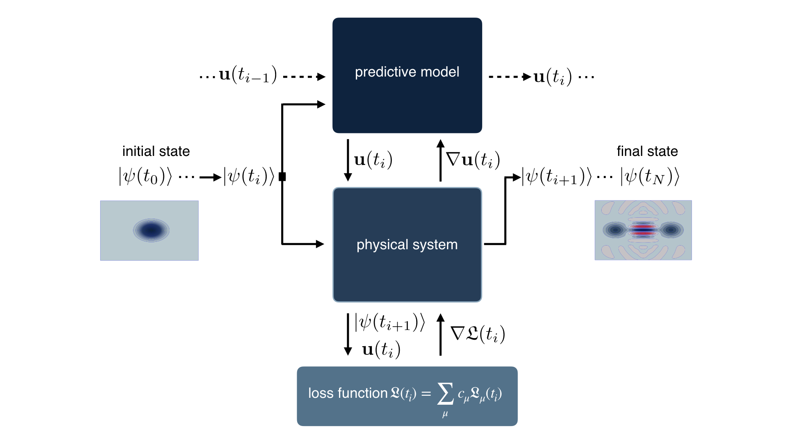

# A-differentiable-programming-method-for-quantum-control

This repository contains a PyTorch implementation for the method introduced in our [paper](https://arxiv.org/abs/2002.XXXXX).

### Abstract of the paper
Optimal control is highly desirable in many current quantum systems, especially to realize tasks in quantum information processing. We introduce a method based on differentiable programming to leverage explicit knowledge of the differential equations governing the dynamics of the system. In particular, a control agent is represented as a neural network that maps the state of the system at a given time to a control pulse. The parameters of this agent are optimized via gradient information obtained by direct differentiation through both the neural network \emph{and} the differential equation of the system. This fully differentiable reinforcement learning approach ultimately yields time-dependent  control parameters optimizing a desired figure of merit. We demonstrate the method's viability and robustness to noise  in eigenstate preparation tasks for three  systems: a single qubit, a chain of qubits, and a quantum parametric oscillator.


<p align="center">
  
</p>

### Environments and task

The repository contains three environments:

    - a single qubit, task: preparation of the |1> state.

    - a spin chain with nearest-neighbor interactions, task: preparation of a GHZ state.

    - a quantum parametric oscillator, task: preparation of a cat state.  


### How to run/ prerequisites:

- install [PyTorch](https://pytorch.org/), numpy, qutip, and matplotlib. (The code is tested on python 3.6.5, qutip 4.4.1, numpy 1.17.2, and PyTorch 1.3.0.)
- individual files can be executed by calling, e.g., python spinchain.py -e 2000 from terminal. Please find the possible parser arguments in the respective python file.
- output data/figures are stored in the associated data folder.
- other Hamiltonian/physical systems can be implemented by modifying the __init__() and the forward() function of the neural network class. For instance, an additional control field, associated with H_2(t), for the parametric oscillator might be implemented by

  adding the additional control operator and the associated output of the neural network to the __init__() function:
  ```python

    # Hamiltonians
    a = qu.destroy(self.dim)
    H_0 = parameters_para.Kerr*(a.dag()**2)*a**2 - parameters_para.pump*(a**2+a.dag()**2)

    H_1 = (a+a.dag())
    # define the additional control operator
    H_2 = (a.dag()*a)

    self.H_0_dt = np.real(H_0.full())*self.dt
    self.H_0_dt = torch.as_tensor(self.H_0_dt, dtype=torch.float, device=device)

    self.H_1_dt = np.real(H_1.full())*self.dt
    self.H_1_dt = torch.as_tensor(self.H_1_dt, dtype=torch.float, device=device)

    self.H_2_dt = np.real(H_2.full())*self.dt
    self.H_2_dt = torch.as_tensor(self.H_2_dt, dtype=torch.float, device=device)

    # add a second output control field
    layers_combine =[
            nn.Linear(64, 64),
            nn.Linear(64, 32),
            nn.Linear(32, 2, bias=True)

  ```
  and also adjusting the output and the step in the forward() function:
  ```python

  alpha1 = alpha[:,:, 0].unsqueeze(-1)
  alpha2 = alpha[:,:, 1].unsqueeze(-1)

  for _ in range(self.n_substeps):
      H = self.H_0_dt+alpha1*self.H_1_dt+alpha2*self.H_2_dt
      x, y = self.Heun(x, y, H)

  ```
  Finally, verify that the loss function is properly defined (also in the forward function). To do so, add for example:
  ```python

  alpha2 = alpha2.squeeze()
  abs_alpha = abs(alpha1) + abs(alpha2)
  loss += self.gamma**j*self.C2*abs_alpha
  last_action_store[1, j] = alpha2

  ```

### This repository..

- [ ] .. does *not* contain the hyperparameter optimization code (based on BOHB) for simplicity. Please contact us directly if you are interested in code relevant for BOHB.
- [x] .. contains the REINFORCE method applied to the single qubit.
- [x] .. also contains an animation of the optimized pulse sequences for the cat-state preparation (see [animation](./misc/movie_cats.gif)).

## Authors:

- [Frank Schäfer](https://github.com/frankschae)
- [Michal Kloc](https://github.com/MikeKlocCZ)
- [Niels Lörch](https://github.com/nloerch)

If you use this code or are influenced by its ideas, please cite:

```
@article{schaefer_DP_2020,
  title={A differentiable programming method for quantum control},
  author={Frank Sch\"{a}fer, Michal Kloc, Christoph Bruder, and Niels L\"{o}rch },
  journal={arXiv preprint arXiv:2002.08376},
  year={2020}
}
```
